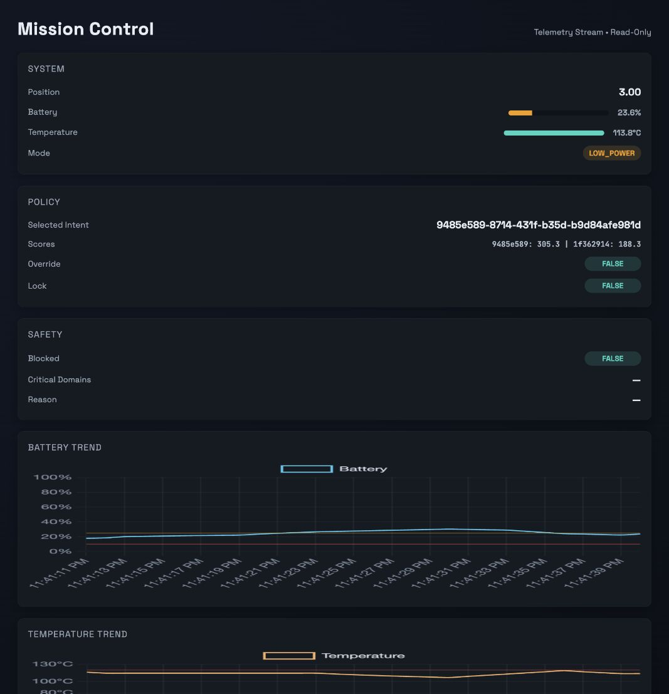

# Telemetry Intent Simulator

[](https://github.com/jjolly2121/telemetry-intent-simulator/actions/workflows/tests.yml)

## Intent-Driven Execution with Telemetry Feedback

### Overview
This project simulates an **intent-driven execution system** with explicit separation between command intent, safety validation, state mutation, and telemetry reporting.

The goal of this project is to explore how **durable intent**, **policy enforcement**, and **observability** interact in safety-critical or distributed systems. Rather than focusing on domain-specific hardware, the system models generalized execution principles that apply to modern infrastructure, autonomous systems, and analytics platforms.

---

## Core Design Principles

- **Intent ≠ Action**  
  Commands are treated as *durable intent*, not immediate execution. Intent may be delayed, blocked, or retried based on policy and system state.

- **Safety Can Block, But Not Erase**  
  A policy/safety gate may prevent execution, but it does not destroy intent. This preserves auditability and explainability.

- **Single State Mutation per Cycle**  
  The system allows only one state update per execution cycle, enforcing determinism and simplifying system reasoning.

- **Telemetry Is Observational**  
  Telemetry reports outcomes and health signals but does not directly drive state mutation. Telemetry may be delayed, partial, or asynchronous.

---

## System Architecture


This diagram illustrates the flow of intent through validation, execution, and reporting layers, with telemetry feedback closing the loop between system state and external observation.

---

## High-Level Execution Flow

Ground Command
|
v
Intent Manager
|
v
Policy / Safety Gate
|
v
State Update Engine
|
v
Telemetry Reporter
^
|
Telemetry Feedback

The dashed boundary represents the **onboard autonomous execution system**, while ground commands and telemetry feedback remain external.

---

## What This Project Demonstrates

- Modeling durable intent and execution lifecycles  
- Enforcing policy constraints without destructive side effects  
- Designing deterministic state transitions  
- Emitting structured telemetry events for observability  
- Separating control flow from monitoring and analytics  

---

## Components

| Module | Responsibility |
|------|----------------|
| `intent_manager.py` | Accepts and stores durable intent |
| `policy_gate.py` | Validates intent against safety and policy rules |
| `state_engine.py` | Applies a single state mutation per cycle |
| `telemetry.py` | Emits execution outcomes and system metrics |
| `main.py` | Runs a fixed-cycle simulation and prints telemetry |
| `mission_control.py` | Real-time mission control dashboard server |
| `simulation_bootstrap.py` | Shared simulation wiring and initial state |
| `tests/` | Core behavior and repository hygiene checks |

---

## Example Telemetry Events

- `intent_received`
- `intent_blocked`
- `intent_authorized`
- `state_updated`
- `execution_latency`
- `telemetry_delayed`

These events are designed to mirror how modern observability platforms reason about system behavior.

---

## Why This Matters

Many real-world systems fail not because of incorrect logic, but because:
- intent and execution are conflated
- safety rules erase context
- telemetry is treated as ground truth instead of observation

This project demonstrates how **clear system boundaries and telemetry-first thinking** improve reliability, explainability, and trust.

---

## Scope Notes

This simulator is intentionally lightweight and educational. It is not intended for production deployment but instead for:
- systems reasoning
- architecture discussion
- observability design exploration

---

## Future Extensions

- Intent retries and backoff strategies  
- Configurable policy rules  
- Telemetry aggregation and summary analytics  
- Visualization of intent lifecycles  

---

## Quick Start

Install dependencies:
```bash
python3 -m venv .venv
source .venv/bin/activate
python -m pip install -r requirements.txt
```

Run the mission control dashboard:
```bash
python mission_control.py
```

Open:
```
http://localhost:5050
```

Run the CLI simulation (prints telemetry frames):
```bash
python main.py
```

Run the test suite:
```bash
python -m unittest discover -s tests -v
```

---

## Mission Control Dashboard

The dashboard is read-only and streams telemetry in real time via WebSockets.



It displays:
- System state (position, battery, temperature, mode)
- Policy decisions (selected intent, scores, override, lock)
- Safety state (blocked, critical domains, reason)
- Trends (battery, temperature, position)
- Cycle log and raw telemetry stream

---

## Shared Simulation Setup

Initial conditions are defined in:
`simulation_bootstrap.py`

To change initial state, edit the bootstrap file, for example:
```python
system_state.battery_level = 4.0
system_state.temperature = 120.0
```

Both `main.py` and `mission_control.py` read from this same bootstrap file.

The default demonstration starts with critically low battery and elevated temperature so the first cycle exercises the safety override and recovery path.

---

## Author Notes

This project was designed as a learning exercise in systems architecture and observability, with inspiration drawn from safety-critical systems, distributed execution engines, and analytics platforms.

## License

The original source code is available under the [MIT License](LICENSE).
